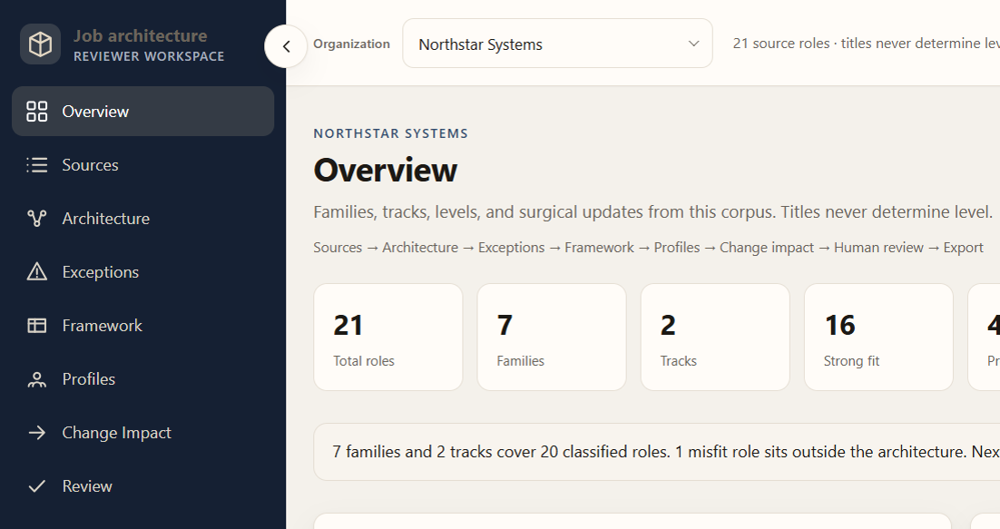
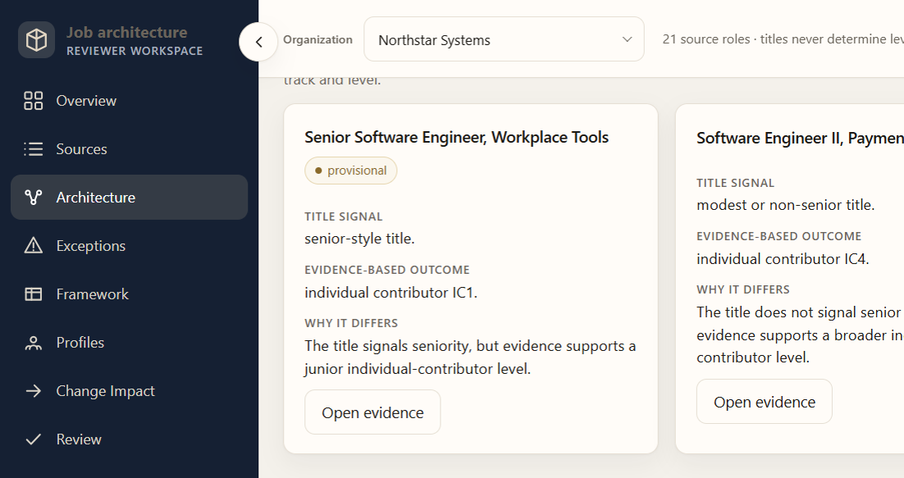
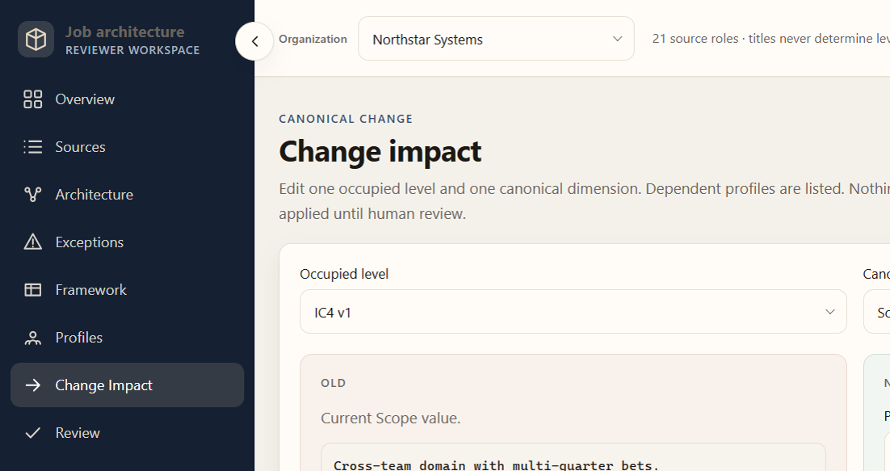

# Job Architecture and Levelling Framework Builder

**Built for the SuperDocs engineering task.**

Reviewer workspace that turns synthetic job descriptions into a defensible job architecture for HR, compensation, and people-strategy review. Local FastAPI + React over a deterministic domain engine. Not a hosted product and not an HRIS.

## Product preview

<p>
  
</p>

<p>
  
  
</p>

## Problem

Existing JDs do not yield a consistent career architecture. Title matching over-levels, under-levels, or invents families. Uncertain work gets forced into a box. Canonical level edits then rewrite unrelated profile text.

## Design principles

| Principle | Meaning |
| --- | --- |
| Evidence-first | Scope, autonomy, complexity, impact, leadership, and related JD dimensions classify the role. Titles do not. |
| Honest uncertainty | Sparse or conflicting evidence stays **provisional**. Work outside the architecture stays a **misfit**. No auto-assign. |
| Human at the gate | Approve and reject are explicit. Mixed decisions are allowed. Apply is a separate step. |
| Surgical propagation | Only listed canonical dimensions change. Unrelated sections are hash-checked. |
| Deterministic offline core | Domain reasoning runs without SuperDocs. Live SuperDocs is optional CLI verification. |

## Reviewer workflow

Sources → Architecture → Exceptions → Framework → Profiles → Change Impact → Review → Export

Analyze a corpus, inspect evidence neighborhoods, review provisional and misfit findings, read the framework and profiles, plan one canonical level edit, approve or reject, then export local DOCX.

## Why this is not title matching

Classification uses extracted evidence. Titles are excluded from clustering tokens and family scoring. Family, track, and level are assigned first. A typed `title_conflict` may then flag:

| Pattern | Example |
| --- | --- |
| Senior-style title vs junior IC evidence | Workplace Tools “Senior” vs defined-ticket IC work |
| Manager-style title vs IC track evidence | Engineering manager title on IC evidence |
| Modest title vs high-scope IC evidence | Payments IC whose scope outruns the title |

The title never assigns family, track, or level. Architecture shows **Title vs evidence** only for those typed conflicts.

## Architecture

- Domain reasoning: evidence, clustering, family/track/level, title-conflict metadata
- Framework and profile generation
- Dependency graph and surgical planner
- SuperDocs adapter + resumable live CLI (`scripts/superdocs_live.py`)
- FastAPI workspace (`python -m job_architecture.web`)
- React / TypeScript reviewer UI (`web/`)

In-memory web state is process-local. Restart the API and re-analyze.

## Outputs

- Canonical framework: IC1–IC5, M1–M3, tracks, families, competency matrices
- Employee-readable role profiles for classified roles
- Review artifacts for misfits (not fabricated normalized profiles)
- Local framework and profile DOCX from the web app
- Live SuperDocs documents via the verified CLI path

## SuperDocs integration

HTTP lives in `src/job_architecture/superdocs/`. Domain reasoning does not call SuperDocs. The browser never performs live SuperDocs export.

| Surface | How it is used | Live verification |
| --- | --- | --- |
| Multi-document | Four JD DOCX files in one session (`open_mode=new_focused`) plus roster check | Four JD document ids coexisted |
| Templates | Framework and role-profile template upload | Two templates uploaded |
| Search | Async chat with `cross_session_search=true`; resume polls the **same** job id | 0 extra POSTs; `verified/terminal/has_result=true` |
| Review | `ask_every_time`; per-change approve/reject | Framework/profile/repair approved; surgical 1–2 rejected; attempt 3 approved |
| Export | `POST /v1/documents/export` (live CLI); local DOCX from the web app | Profile DOCX succeeded; framework attempt 3 HTML + `session_id` semantic PASS |

Live record: `docs/live-verification.md`. Framework export attempts 1–2 HTTP-succeeded but returned a source JD and are retained as failed evidence. Attempt 3 used documented HTML + `session_id` (15,650 chars) and semantic verification passed.

There is no hosted deployment.

## Surgical propagation proof

Change Impact is the reviewer hero path: one occupied level, one canonical dimension, OLD → NEW, affected vs unaffected counts, dependency path, update plans, preservation proof.

Live proof (`docs/live-verification.md`):

- Attempt 1 rejected (unrelated Complexity rewrite)
- Attempt 2 rejected (duplicated live baseline)
- Attempt 3 approved: version + Scope only
- Rejected attempts remain in history; domain apply happens only after local verification

## Exceptions and uncertainty

Sparse, hybrid, and outside-architecture roles remain provisional or misfit. The UI does not auto-assign them. Misfit is an architecture finding that needs a human decision, not an application error.

## Two-corpus validation

Both corpora are synthetic. No real employee data. The same engine runs on both; production Python does not branch on organization or fixture ids.

| Corpus | Organization | What it exercises |
| --- | --- | --- |
| `corpus-a` | Northstar Systems | 21 roles, title/scope conflicts, hybrid Solutions Architect, sparse Program Coordinator, Developer Advocate misfit |
| `corpus-b` | Meridian HealthTech | Independent second corpus, misleading Principal title, hybrid Clinical Implementation Architect, sparse Associate Special Programs, Medical Science Liaison misfit |

## Repository structure

```text
fixtures/corpus-a|corpus-b   Markdown JDs
src/job_architecture         Domain engine, SuperDocs adapter, FastAPI
web/                         React reviewer UI
scripts/superdocs_live.py    Live CLI only
tests/                       Offline pytest
docs/                        Assignment, live, security, clone evidence
screenshots/                 UI captures
```

## Run locally

Windows, from `use-cases/Rahul9214/job-architecture-builder/`. Python 3.11+.

### Backend and tests (offline)

```text
python -m venv .venv
.\.venv\Scripts\python.exe -m pip install -e ".[dev]"
.\.venv\Scripts\python.exe -m pytest
.\.venv\Scripts\python.exe -m compileall src tests
```

No SuperDocs key is required. Offline pytest does not call SuperDocs.

### Production UI

```text
cd web
npm ci
npm run build
cd ..
.\.venv\Scripts\python.exe -m job_architecture.web
```

Open **http://localhost:8000**. Deep links (`/architecture`, `/impact`, …) must return the SPA, not 404, when `web/dist` exists.

If port 8000 is busy:

```text
$env:JOB_ARCH_PORT="8020"
.\.venv\Scripts\python.exe -m job_architecture.web
```

Then open **http://localhost:8020**.

### Frontend development (optional)

```text
cd web
npm ci
npm run dev
```

Vite proxies `/api`. Default `http://localhost:5173`; Vite may pick another port if 5173 is busy.

Frontend checks: `npm run lint`, `npm run typecheck`, `npm test`, `npm run build`.

## Offline mode

Leave `SUPERDOCS_API_KEY` unset. Analyze corpora, inspect architecture, plan surgical updates, review, and export local DOCX. Export shows SuperDocs as **not configured** and does not call the live API.

## Optional live SuperDocs

Copy `.env.example` to `.env` and set **your** `SUPERDOCS_API_KEY`. Never commit `.env`. The web API does not return the key.

Live work is the CLI only (`python scripts/superdocs_live.py … --confirm`). The reviewer UI remains a local browser app.

## Testing

Latest working-tree run (this release-candidate UI pass, with `web/dist` present):

- Backend: **250 passed** (`python -m pytest`)
- Frontend: **13 passed** (`npm test`)

Lighthouse scores are environment-sensitive. Measure the **production FastAPI bundle**, Chrome Incognito, extensions disabled, mobile preset, at least three runs. Extensions, DevTools, CPU load, and cache change the Performance number. Accessibility and Best Practices should stay ≥ 95. SEO is not a core assignment requirement.

Clean-clone of commit `274866e` (pytest before `npm run build`): **234 passed, 1 skipped** (SPA fallback skipped until dist exists). After build, `GET /` and `GET /architecture` returned the SPA. See `docs/clean-clone-verification.md`. Re-run clone verification after this uncommitted pass is committed.

## Security / operational hygiene

- `.env` is gitignored
- Runtime state refuses secret keys
- API SuperDocs status redacts credentials
- `.runtime/`, `exports/`, `artifacts/`, `.venv/`, `node_modules/`, and `web/dist/` are gitignored
- See `docs/security-check.md`

## Limitations

- Deterministic lexical / TF-IDF architecture reasoning, not embedding clustering
- In-memory web workspace (re-analyze after restart)
- No HRIS, ATS, compensation bands, or employee records
- No authentication / RBAC
- Live SuperDocs needs the reviewer’s own API key
- No hosted deployment
- Web live export is intentionally unavailable; the verified path is the CLI

## Evidence documentation

- [Task specification](TASK2.md)
- [Assignment audit](docs/assignment-audit.md)
- [Live SuperDocs record](docs/live-verification.md)
- [Manual acceptance](docs/manual-acceptance.md)
- [Clean-clone verification](docs/clean-clone-verification.md)
- [Secret check](docs/security-check.md)
- [PR checklist](docs/pr-checklist.md)
- [Progress](PROGRESS.md)
- [Assumptions](ASSUMPTIONS.md)
- [Test plan](TEST_PLAN.md)
