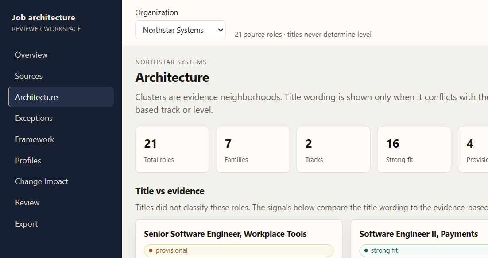
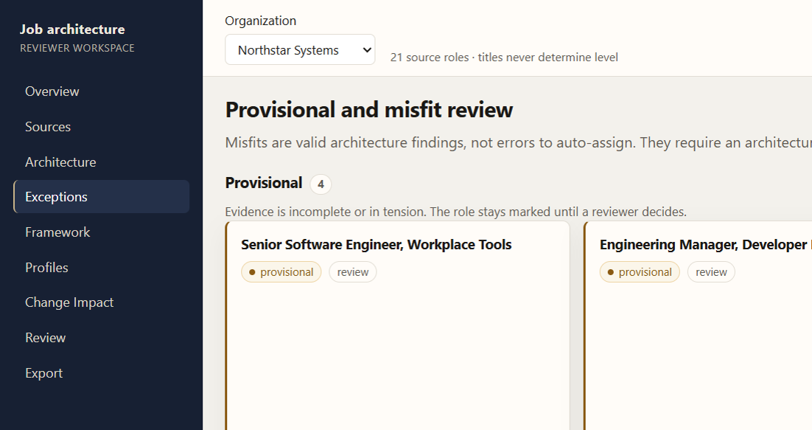
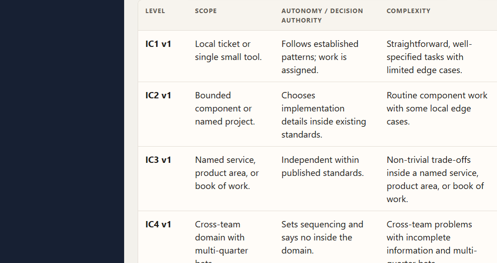
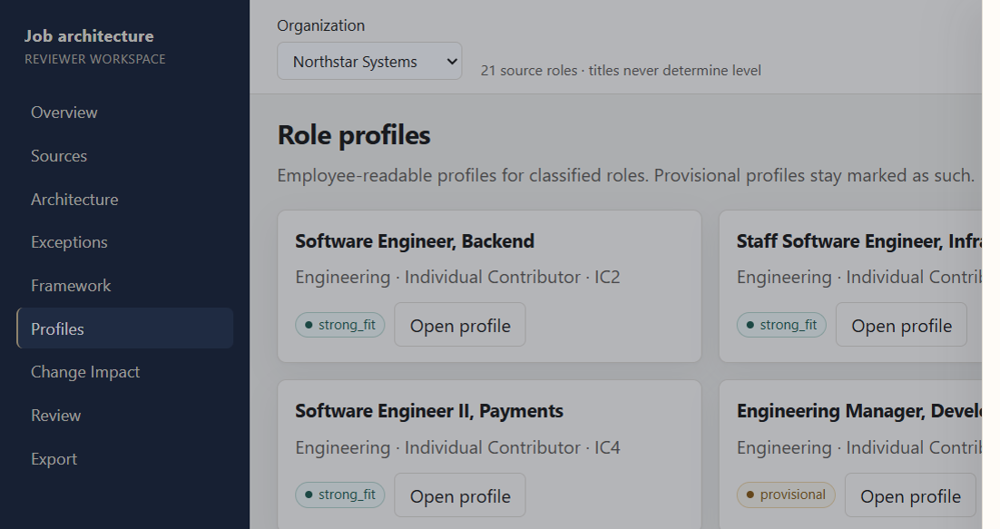
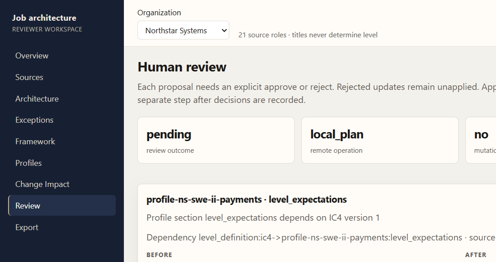
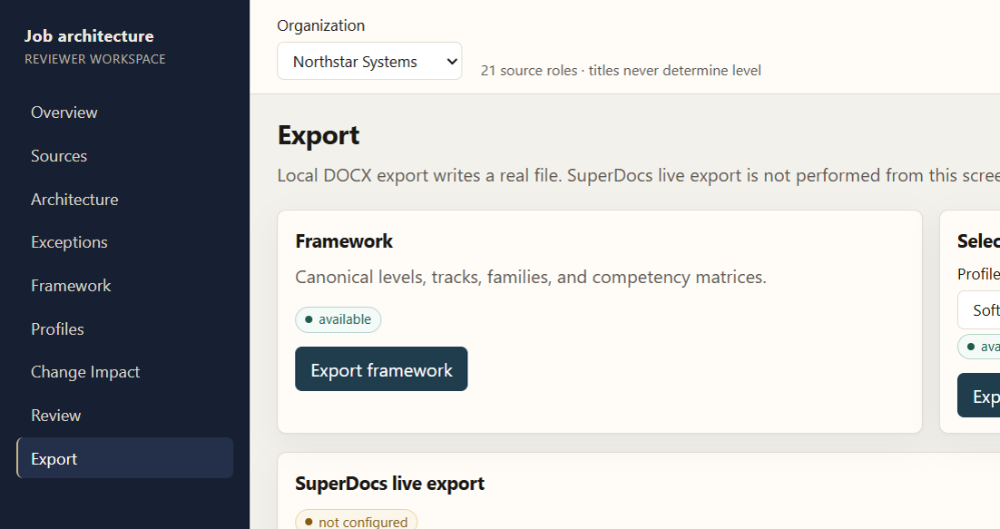

# Job Architecture and Levelling Framework Builder

Task 2 submission: a reviewer workspace that turns **synthetic job descriptions** into a defensible job architecture for HR, compensation, and people-strategy review.

It is a local FastAPI + React app over a deterministic domain engine. It is not a hosted product and not an HRIS.

## Overview

Given a corpus of Markdown job descriptions, the application proposes job families, career tracks, canonical levels, per-family competency matrices, and employee-readable role profiles. Uncertain work stays **provisional**. Work outside the architecture stays a **misfit**. Canonical level edits identify dependent profiles, patch only the required fields, and stay unapplied until a human approves or rejects them.

## Why this is not title matching

Classification uses extracted evidence (scope, autonomy, complexity, impact, leadership, people management, decision authority, stakeholders, domain depth, outcomes). Titles are excluded from clustering tokens and family scoring.

After evidence-based family / track / level exist, a typed `title_conflict` may flag:

- senior-style title vs junior IC evidence
- manager-style title vs IC track evidence
- modest title vs high-scope IC evidence

The title never assigns family, track, or level. Architecture shows **Title vs evidence** only for those typed conflicts.

## What the application produces

- Job families (catalog labels applied after evidence clustering)
- Career tracks (individual contributor and people manager)
- Canonical levels IC1–IC5 and M1–M3 (unoccupied M2/M3 remain in the catalog)
- Competency matrices by family
- Employee-readable role profiles
- Honest exceptions (provisional, hybrid/bridge, misfit)
- Change-impact plans and preservation reports

## Workflow

Sources → Architecture → Exceptions → Framework → Profiles → Change Impact → Review → Export

## Key controls

- Evidence over title
- Provisional and misfit honesty (no auto-assign)
- Explicit dependency edges (level → `level_expectations`)
- Surgical propagation (only changed canonical dimensions)
- Explicit human approve / reject (mixed decisions allowed)
- Verified preservation (section hashes; rejected plans stay unapplied)

## SuperDocs integration

HTTP lives in `src/job_architecture/superdocs/`. Domain reasoning does not call SuperDocs. The browser never performs live SuperDocs export.

Surfaces actually used:

| Surface | How |
| --- | --- |
| Multi-document | Four JD DOCX files in one session (`open_mode=new_focused`) plus roster check |
| Templates | Framework and role-profile template upload |
| Search | Async chat with `cross_session_search=true`; resume polls the **same** job id |
| Review | `ask_every_time`; per-change approve/reject |
| Export | `POST /v1/documents/export` (live CLI); local DOCX from the web app |

What was **live-verified** (see `docs/live-verification.md`): four JDs coexisted; two templates uploaded; framework and profile reviewed edits approved; profile duplicate repair approved; surgical attempts 1–2 rejected and kept in history; attempt 3 approved (version + Scope only); structure and preservation verification passed; Search resumed with 0 extra POSTs and reached `verified/terminal/has_result=true`; profile DOCX export succeeded; domain apply only after local verification. Live framework export attempt 1 returned a source JD (session-only); attempt 2 still returned that JD after undocumented `document_id` / `durable_document_id` were supplied; **attempt 3 used documented HTML + `session_id` (15,650 chars) and semantic verification passed** (`verify-framework-structure` `semantic ok=True`).

There is no hosted deployment.

## Architecture

- Domain reasoning: evidence, clustering, family/track/level, title-conflict metadata
- Framework and profile generation
- Dependency graph and surgical planner
- SuperDocs adapter + resumable live CLI (`scripts/superdocs_live.py`)
- FastAPI workspace (`python -m job_architecture.web`)
- React / TypeScript reviewer UI (`web/`)

In-memory web state is process-local. Restart the API and re-analyze.

## Demo corpora

Both are synthetic. No real employee data.

- **Northstar Systems** (`corpus-a`): 21 roles, including title/scope conflicts, a hybrid Solutions Architect, sparse Program Coordinator, and Developer Advocate misfit.
- **Meridian HealthTech** (`corpus-b`): independent second corpus, including misleading Principal title, hybrid Clinical Implementation Architect, sparse Associate Special Programs, and Medical Science Liaison misfit.

## Run locally

Windows, from `use-cases/Rahul9214/job-architecture-builder/`. Python 3.11+.

### Backend and tests

```text
python -m venv .venv
.\.venv\Scripts\python.exe -m pip install -e ".[dev]"
.\.venv\Scripts\python.exe -m pytest
.\.venv\Scripts\python.exe -m compileall src tests
```

No SuperDocs key is required.

### Production UI

```text
cd web
npm ci
npm run build
cd ..
.\.venv\Scripts\python.exe -m job_architecture.web
```

Open `http://127.0.0.1:8000`. If that port is busy, set `JOB_ARCH_PORT`. Deep links (`/architecture`, `/impact`, …) must return the SPA, not 404, when `web/dist` exists.

### Frontend development (optional)

```text
cd web
npm ci
npm run dev
```

Vite proxies `/api`. Default `http://127.0.0.1:5173`; Vite may pick another port if 5173 is busy.

Frontend checks: `npm run lint`, `npm run typecheck`, `npm test`, `npm run build`.

## Optional SuperDocs live verification

Copy `.env.example` to `.env` and set **your** `SUPERDOCS_API_KEY`. Never commit `.env`. The web API does not return the key.

Live work is the CLI only (`python scripts/superdocs_live.py … --confirm`). Leave the key unset for offline reviewer mode.

## Testing

Latest working-tree run (production hardening session, with `web/dist` present):

- Backend: **250 passed** (`python -m pytest`)
- Frontend: **12 passed** (`npm test`)

Clean-clone of commit `274866e` (pytest before `npm run build`): **234 passed, 1 skipped** (SPA fallback skipped until dist exists). After build, `GET /` and `GET /architecture` returned the SPA. See `docs/clean-clone-verification.md`.

## Screenshots
















## Limitations

- Deterministic lexical / TF-IDF architecture reasoning, not embedding clustering
- In-memory web workspace (re-analyze after restart)
- No HRIS, ATS, compensation bands, or employee records
- No authentication / RBAC
- Live SuperDocs needs the reviewer’s own API key
- No hosted deployment

## Assignment evidence

- [Task specification](TASK2.md)
- [Assignment audit](docs/assignment-audit.md)
- [Live SuperDocs record](docs/live-verification.md)
- [Manual acceptance](docs/manual-acceptance.md)
- [Clean-clone verification](docs/clean-clone-verification.md)
- [Secret check](docs/security-check.md)
- [PR checklist](docs/pr-checklist.md)
- [Progress](PROGRESS.md)
- [Assumptions](ASSUMPTIONS.md)
- [Test plan](TEST_PLAN.md)
